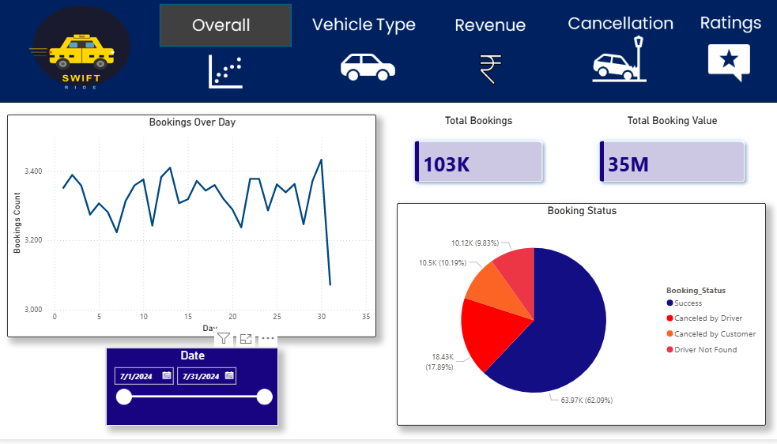
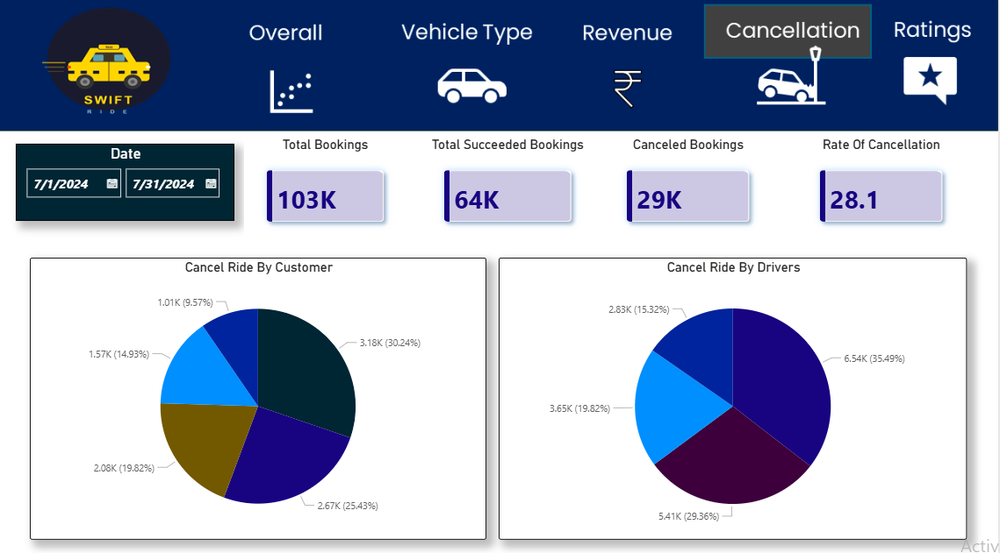
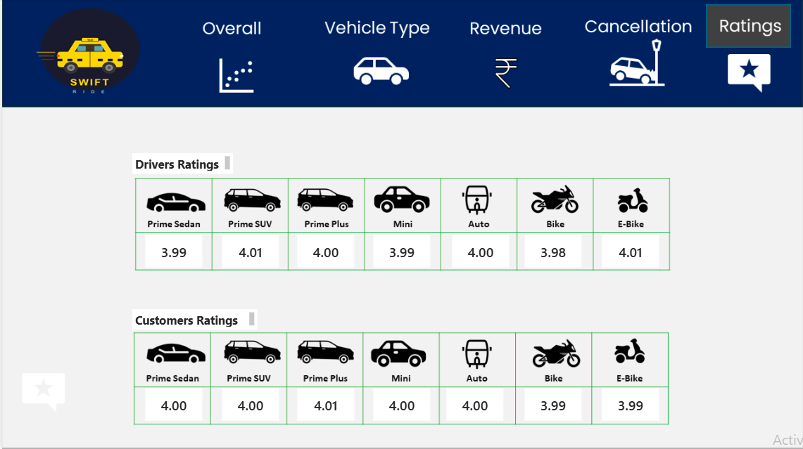

# Ride-Data-Analysis
Data analysis project using Excel, SQL and Power BI.

# Ride Data Analysis

## Project Overview

This project focuses on analyzing ride booking data using Excel, SQL and Power BI.

The dataset contains over 103,000 ride bookings. The goal was to explore booking trends, analyze cancellations, understand revenue patterns and create an interactive dashboard for better business insights.

---

## Dataset Information

- Total Records: 103,024
- Total Columns: 20

The dataset includes information such as:

- Booking Date & Time
- Booking Status
- Vehicle Type
- Pickup & Drop Location
- Booking Value
- Payment Method
- Ride Distance
- Driver Ratings
- Customer Ratings

---

## Tools Used

- Microsoft Excel
- MySQL
- Power BI

---

## Dashboard Pages

### 1. Overall Dashboard

- Total Bookings
- Booking Value
- Daily Booking Trend
- Booking Status Distribution



---

### 2. Vehicle Type Analysis

- Booking Value by Vehicle Type
- Successful Booking Value
- Average Distance Travelled
- Total Distance Travelled


---

### 3. Revenue Analysis

- Revenue by Payment Method
- Distance Travelled by Date
- Top Customers


---

### 4. Cancellation Analysis

- Cancellation Rate
- Customer Cancellation Analysis
- Driver Cancellation Analysis



---

### 5. Ratings Analysis

- Driver Ratings
- Customer Ratings
- Vehicle-wise Rating Comparison



---

## Key Insights

- More than 103K bookings were analyzed.
- Successful bookings contributed the highest share of total bookings.
- Cash and UPI were the most commonly used payment methods.
- Vehicle types showed similar booking value with differences in travel distance.
- Customer and driver ratings remained close to 4 across most vehicle categories.

---

## Project Structure

```text
Ride-Data-Analysis
│
├── Dataset
├── SQL
├── PowerBI
├── Images
└── README.md
```

---

## Author

Shubham Yadav

This project was created as part of my Data Analytics learning journey to improve my SQL, Excel and Power BI skills.
